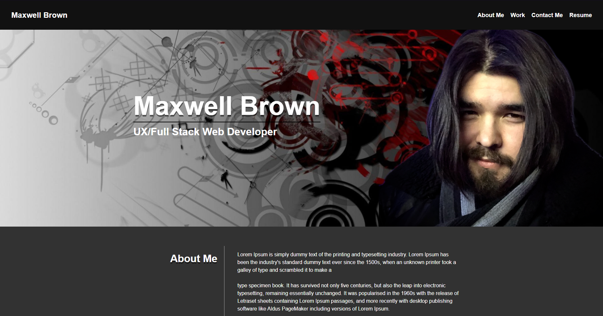

# my-portfolio

## Description

Maxwell Brown's portfolio with contact information, past projects, information on myself and a link to my resume

## Getting Started

### Dependencies

* None

### Installing

* Install gitbash
* Copy code https
* Use "git clone (code) (./folderyoucreate)"

### Executing program

* Right click on index.html and select open with (preferred browser)

### Usage

Website header can be clicked on to take user to the relevant section of the page

## Authors

Contributors names and contact info:

4scheriit  
mbrownet@gmail.com

## License

This project is licensed under the MIT License - see the LICENSE.md file for details
